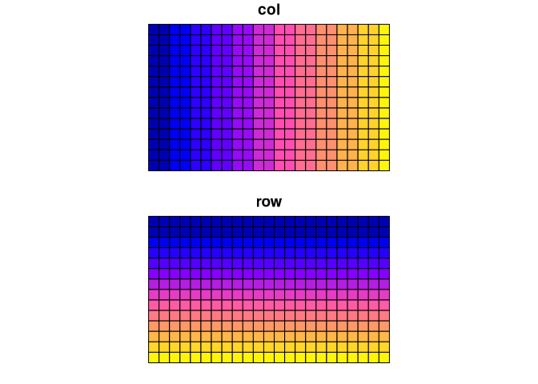

<!-- README.md is generated from README.Rmd. Please edit that file -->
rgeopat2
========

[](https://travis-ci.org/Nowosad/rgeopat2) [](https://codecov.io/gh/Nowosad/rgeopat2) [](https://cran.r-project.org/package=rgeopat2)

The goal of rgeopat2 is to enhance the functionality of [geoPAT 2.0](http://sil.uc.edu/cms/index.php?id=geopat2).

Installation
------------

You can install rgeopat2 from github with:

``` r
# install.packages("devtools")
devtools::install_github("Nowosad/rgeopat2")
```

Example
-------

This is a basic example which shows you how to create a grid polygon based on the geoPAT 2.0 header file:

``` r
library(rgeopat2)
header_filepath = system.file("rawdata/Augusta2011_grid100.hdr", package="rgeopat2")
my_grid = gpat_gridcreate(header_filepath)
plot(my_grid)
```


